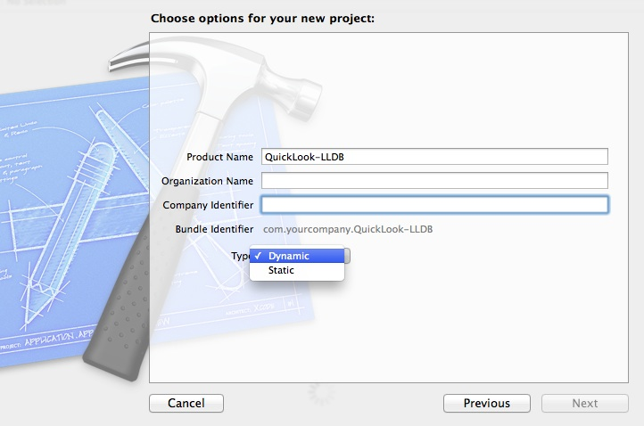
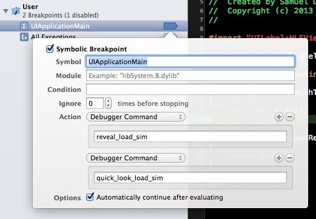

Xcode 5 added [QuickLook support](https://developer.apple.com/library/mac/documentation/IDEs/Conceptual/CustomClassDisplay_in_QuickLook/Introduction/Introduction.html) for standard types like `UIImage`, `NSData` or `NSString`, right within Xcode. Starting with Xcode 5.1, `UIView` and custom types can be quickly previewed as well, which can be quite convenient when debugging projects. 

The [LLDB-QuickLook](https://github.com/ryanolsonk/LLDB-QuickLook) project adds a similar functionality to the LLDB Xcode console as well, but requires some categories to be added to each project you want to use LLDB-QuickLook with. This process is rather inconvenient since it requires you to edit your projects to make these categories somehow available (most probably by including the corresponding source files).

Based on a [trick](http://blog.ittybittyapps.com/blog/2013/11/07/integrating-reveal-without-modifying-your-xcode-project/) similar to the one used to link in [Reveal](http://revealapp.com/) dynamic library, we can improve LLDB-QuickLook so that its categories can be used transparently with all your projects.

Instead of adding the categories to the projects, the LLDB-QuickLook categories can namely be packaged as a dynamic library, and made available when LLDB starts. Within the iOS simulator, the library can be loaded without `dlopen`-ing it from the application, and without [jailbreaking](http://petersteinberger.com/blog/2013/how-to-inspect-the-view-hierarchy-of-3rd-party-apps/). This is why this post only focuses on the iOS simulator.

The approach described below can be applied to your own LLDB debugging helpers, which can be packaged as a dynamic library shared between your projects.

# Enabling iOS dynamic library compilation in Xcode

Apple does not officially provide a way to create dynamic libraries for iOS, since their use does not comply with App Store rules. Xcode unsurprisingly complains when we try to build one:

	target specifies product type 'com.apple.product-type.library.dynamic', but there's no such product type for the 'iphonesimulator' platform

You can still enable iOS dynamic library support by editing some Xcode configuration files, though, as described [elsewhere](http://mysteri0uss.diandian.com/post/2013-06-06/40050450784):

* For the simulator, open the Mac OS specification file:

		/Applications/Xcode.app/Contents/Developer/Platforms/MacOSX.platform/Developer/Library/Xcode/Specifications/MacOSX Product Types.xcspec
	
	and copy over the section beginning with `com.apple.product-type.library.dynamic` to its iOS counterpart:

		/Applications/Xcode.app/Contents/Developer/Platforms/iPhoneSimulator.platform/Developer/Library/Xcode/Specifications/iPhone Simulator ProductTypes.xcspec
	
* Proceed similarly with the following files:

		/Applications/Xcode.app/Contents/Developer/Platforms/MacOSX.platform/Developer/Library/Xcode/Specifications/MacOSX Package Types.xcspec
		/Applications/Xcode.app/Contents/Developer/Platforms/iPhoneSimulator.platform/Developer/Library/Xcode/Specifications/iPhone Simulator PackageTypes.xcspec
	
	and the section beginning with `com.apple.package-type.mach-o-dylib`

Restart Xcode to take the changes into account.

# Building an LLDB-Quicklook dynamic library

To build a dynamic library we create a Mac OS X Cocoa Library project, setting its type to _dynamic_. We remove all useless stuff, set its SDK to _Latest iOS_ and add LLDB-QuickLook source files. The resulting project can be found on my [Github page](https://github.com/defagos/LLDB-QuickLook/tree/dylib), on a branch called `dylib`.

Checkout the repository, switch to the `dylib` branch and run the following command to build the library:

	 xcodebuild -sdk iphonesimulator -configuration Release -project LLDB-QuickLook.xcodeproj
	 
The dynamic library can be found in the `build` directory, and is called `LLDB-QuickLook.dylib`.

# Loading the LLDB-QuickLook dynamic library into LLDB

To load the `LLDB-QuickLook.dylib` dynamic library when LLDB starts, copy it somewhere (e.g. `~/Library/lldb/lib/LLDB-QuickLook.dylib`) and add the following line to your `~/.lldbinit` configuration file:

	command alias quick_look_load_sim process load ~/Library/lldb/lib/LLDB-QuickLook.dylib
	
replacing the path by the one you chose.
	
The `quick_look_load_sim` command can be manually triggered in LLDB to load the library (when running in the iOS simulator), but cannot work when no process has been attached. 

To run the `quick_look_load_sim` command early when an application has been attached, add a user-defined symbolic breakpoint on a function which gets called early, e.g. `UIApplicationMain`. User-defined breakpoints are common to all you projects, and can trigger actions, like executing LLDB commands. To call our custom `quick_look_load_sim` command, add a _Debugger Command_ action calling `quick_look_load_sim` to the breakpoint, and check _Automatically continue after evaluating_.

There is hope pending breakpoints [might be added](http://prod.lists.apple.com/archives/xcode-users/2013/Feb/msg00069.html) to LLDB in the future, in which case this trick could be replaced with pending breakpoints defined in the `~/.lldbinit` file.

# QuickLooking

Follow the [LLDB-QuickLook installation steps](https://github.com/ryanolsonk/LLDB-QuickLook/blob/master/README.md) and add the following commands to your `~/.lldbinit` file:
	
	command script import ~/Library/lldb/lldb_quick_look.py
	command alias ql quicklook

Here I saved the Python script under `~/Library/lldb`.

Now run any project in the simulator (be sure that the user-defined breakpoint is available), pause the execution, and try to enter a QuickLook LLDB command, e.g.

	ql @"Hello, World!"
	
QuickLook should open and display the string.

# Wrapping up

This post discussed how debugging code can be packaged as a dynamic library, and how it can be automatically loaded when an application is debugged in the iOS simulator. By applying the same strategy, you could package your own LLDB debugging helpers as dynamic libraries which can be shared between your projects, without having to modify them. Have fun!

